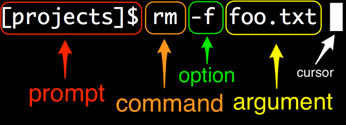
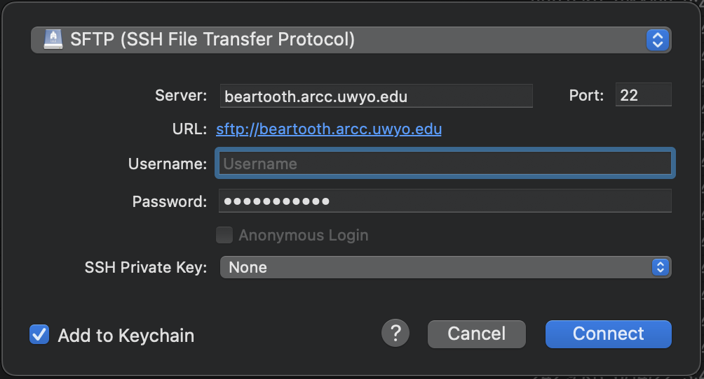
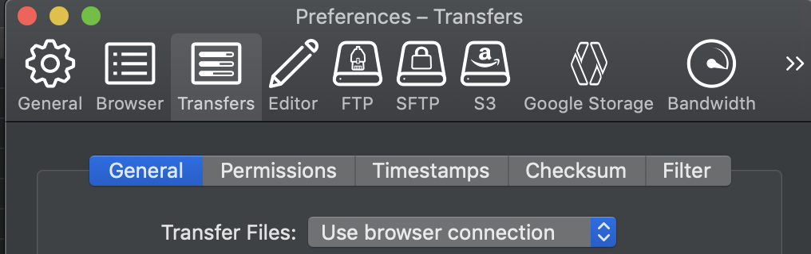
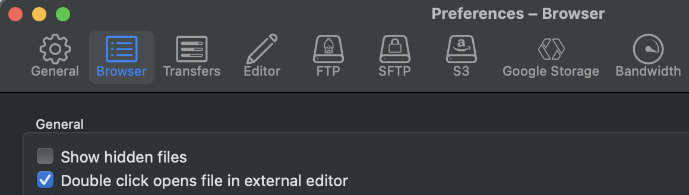

# Introduction to Beartooth

July 18, 2023

[Home](https://github.com/wyoibc/2023repres_popgen)

<br>


## Table of Contents

- [Overview](#Overview)
- [Logging in](#logging-in)
- [Navigating Beartooth](#navigating-beartooth)
- [Moving, copying, and removing files](#moving-copying-and-removing-files)
- [Where to store files](#where-to-store-files)
- [Editing files](#editing-files)
- [Globbing and some useful shortcuts](#globbing-and-some-useful-shortcuts)
- [Transferring files to and from Beartooth](#transferring-files-to-and-from-beartooth)
- [Searching in a file](#searching-in-a-file)
- [Compute nodes vs. login nodes](#Compute-nodes-vs-login-nodes)
	- [Interactive sessions](#Interactive-sessions)
	- [Submitting jobs](#Submitting-jobs)
	- [SLURM](#SLURM)
- [Loading software](#Loading-software)
	- [Modules](#Modules)
	- [Conda](#Conda)
- [Job arrays](#Job-arrays)
- [Some little tricks](#Some-little-tricks)
	- [Multiple sessions, single login](#Multiple-sessions-single-login)
	- [Aliases](#Aliases)


<br><br><br>
<center>

<a title="James St. John, CC BY 2.0 &lt;https://creativecommons.org/licenses/by/2.0&gt;, via Wikimedia Commons" href="https://commons.wikimedia.org/wiki/File:Beartooth_Mountains_(Montana-Wyoming_border_area,_USA)_3.jpg"></a>


</center>
<br><br><br>

## Overview

Beartooth is the University of Wyoming's primary high-performance computing (HPC) cluster. It is essentially a bunch of computers all linked together that users can remotely access to run analyze data. If you were previously familiar with Teton, Beartooth is an updated version. Beartooth is free to use for UW researchers, and is administered and maintained by UW's [Advanced Research Computing Center (ARCC)](https://www.uwyo.edu/arcc/index.html). 

In order to access Beartooth, users must first be added to a project. Projects are essentially accounts, and every user on Beartooth is associated with at least one project. Projects are associated with particular resources like storage and track usage of the cluster by users. In many cases, all members of a lab will share a project. Users may also be affiliated with projects that are created for specific collaborations or other purposes. We'll talk more about some of the relevant aspects of projects in a bit.

You can gain access to existing projects using [this form](https://arccwiki.atlassian.net/servicedesk/customer/portal/2/group/15/create/36) with the approval of the project PI. If you need to create a new project, use [this form](https://arccwiki.atlassian.net/servicedesk/customer/portal/2/group/15/create/44).

Beartooth (and nearly all other HPC systems) uses a Linux operating system. The primary way to interact with Beartooth is via the command line using bash commands. Linux is similar to the Unix-based operating system on Mac computers, and if you have used the terminal on a Mac, then the Linux terminal will be very familiar.

<br>
<br>

For more information on Beartooth, you can see ARCC's documentation [here](https://arccwiki.atlassian.net/wiki/spaces/DOCUMENTAT/pages/1683587073/Beartooth)


ARCC also maintains a separate cluster, WildIris that was developed to support users outside of UW (e.g., WY community college faculty and students) and does not require UW credentials for access. Contact the INBRE Data Science Core if you are interested in this resource.

This tutorial borrows info from Joe's bash tutorial: [https://github.com/Joseph7e/HCGS-BASH-tutorial](https://github.com/Joseph7e/HCGS-BASH-tutorial)

* Note that every topic we cover will be only an introduction, and you can dive deeper into any of these

<br>
<br>

## Logging in

Once you have been added to a new or existing project on Beartooth, you can log in using one of a few methods.


### Secure Shell (SSH)
SSH is a method of securely communicating with another computer.


Logging into Beartooth follows the same general procedure as logging into most remote servers. If you are on a Mac or running a Linux operating system, then you can log in directly from the terminal. If you are on a Windows machine, I believe that the most recent operating systems include a terminal that can allows for `ssh` login as if one were on a Linux/Unix-based machine. If that is not the case, you will need to install an ssh client to allow you to log into and communicate with Beartooth, such as [MobaXterm ](https://mobaxterm.mobatek.net/download.html) or [PuTTY](https://www.putty.org/).


Detailed instructions for logging into Beartooth are described on ARCC's site [here](https://arccwiki.atlassian.net/wiki/spaces/DOCUMENTAT/pages/1074757639/Logging+Into+HPC). We'll assume that you've completed your first login and that you already have Duo authentication set up. At this point, on a Mac or Linux, you can open a terminal window, type 

`ssh <username>@beartooth.arcc.uwyo.edu`

(where <username> should be replaced by your username on the system)

Then when prompted for a password, enter your password. You will not see `**` or dots appear as you type characters but they are being typed (assuming your computer/keyboard are functioning normally). After you type your password and hit enter, you should shortly get a Duo notification, and once you authenticate, you should be logged in.


This will work basically the same in MobaXterm or PuTTY, but you will put `<username>@beartooth.arcc.uwyo.edu` into the hostname/session window instead of entering it on the command line.


### Exiting Beartooth

When you are done on Beartooth, you can log out with the simple command `exit`.


### OnDemand

You can also access Beartooth using Southpass, ARCC's implementation of OnDemand. This is documented [here](https://arccwiki.atlassian.net/wiki/spaces/DOCUMENTAT/pages/1298071553/SouthPass). We won't use this right now, but it is an alternative that may be helpful if you are having trouble logging in otherwise. It also has cool functionality, including the ability to use RStudio with a graphical interface on Beartooth. We will explore this in a subsequent session when we start using R, and I will put the link to that tutorial here once I make it.

<br>
<br>

## Navigating Beartooth

As stated above Beartooth runs a Linux operating system, as do the vast majority of other HPC clusters. When using Beartooth (and other clusters) we have no graphical interface or desktop. Instead, we interact primarily via the command line (for some tools that are exceptions to this, see info about Southpass and Cyberduck below).

This means that we can't just click our way around the cluster to get where we want or see what files and programs are available. Instead, we have to learn some commands that we can use to accomplish these tasks. Commands are entered into the command line in the terminal, and generally share a common structure:



Note that your prompt will look different from mine because I have changed some options in my bash profile (we'll get to this later), and the prompt will look different on different clusters.

One of the most common commands you'll use is 

`ls`

This command lists files and directories. If you run it with no options or arguments, it will do this for the directory you are currently in. 

**Commands are case sensitive!** If you type `LS` it will not be recognized as `ls`. Spaces between options/arguments are also important to delineate when a new option or argument starts. In most cases, the number of spaces is not critical, but it can be for some applications.

When you first log in, you'll be in your home directory, you can always confirm your current directory with the

`pwd`

command (for "print working directory"). This will show you the full path to where you are currently, i.e., all of the nested directories that you are inside of. You should do this often to make sure you're working where you think you are!

If you have not previously used Beartooth, then you likely won't have any files to see when you run `ls`. We can use `touch` to create a blank text file in our current directory.

```
touch test.txt
```

* Side note: when working in Bash, file extensions are often only used for human convenience and programs will typically not automatically add a file extension. I added `.txt` here so that I know this is a text file (albeit an empty one). We could leave the extension off or use any arbitrary extension and most programs that read text files will still read this file just fine.

Here we have to supply an argument to `touch` to tell it what to name the file. If we run `ls`, we should now see what file listed. I personally prefer to always run `ls` with some additional options as:

`ls -ltrh`

where `l` is long form (includes date information, owner, permissions, and size), `tr` is sort by time, and in reverse (newest files at the bottom), and `h` is human readable so that file sizes are in KB, MB, GB, etc instead of always in bytes.

You can move around on the cluster using `cd` followed by any path (or if you enter `cd` with no path, it will take you to your home directory). If you run

```
cd /
```

It will take you to the root directory of the server. If you run `ls` or `ls -ltrh` here, you'll see all the directories and files that exist in that directory - you won't have permissions to modify most of these and may not be able to even view some.

* **You can return to your home directory by typing `cd`, `cd ~` (the tilde is a shortcut for your home directory), or `cd` followed by the full path to your home directory.** `~` can also be used in paths in other contexts like copying files, designating paths to input files for programs, etc.

Once back in your home directory, make a new directory called "t3_2022" using the `mkdir` command to make a directory:

```
mkdir wkshp_test
```

Then navigate into it:

```
cd wkshp_test
```

Note that here we didn't have to use the full path, only what's called the "relative path", meaning we tell the computer where to go relative to where we are already. If we ran that command from somewhere else, it wouldn't work, because the computer doesn't know where to look for `wkshp_test`. You can think of this like addresses. If we're in Laramie and I say to go to 108 Grand Ave (Coal Creek Tap), the directions make sense relative to us being in Laramie already. If we're in Ft. Collins, CO, that address doesn't exist, and you need to provide the full address for anyone to be able to get there.

We can navigate up one directory from wherever we are by using `..`

`cd ..`

This can be chained together to move up two or more directories: `cd ../..` goes up two directories, `../../..` goes up three. This can be a bit confusing, so you may want to `pwd` when you finish to know where you are.


Note that if you just want to see what's inside some directory, you can use `ls` without moving into that directory first:


```bash
# List the contents of your home directory
ls ~

# list contents of one directory up from where you are
ls .. 

# list the contents of the root directory
ls /

# list the contents of the wkshp_test directory you made in your home directory

ls ~/wkshp_test
```

I think that this above is the first time that I've used `#` in a code block so far. In Bash, `#` denotes a comment, and anything after that character is ignored and treated as code to be evaluated. This allows you to put notes and explanations into Bash code, which is particularly useful when writing scripts.

<br>
<br>

## Moving, copying, and removing files

The **move** command - mv

  + mv \<file> \<destination>

The **copy** command - cp

  + cp \<file> \<destination>

The **remove** command - rm

  + rm \<file>

```bash
# make a new directory
mkdir my_directory/

# move a file up one directory
mv my_file.txt ../

# move and rename a file
mv my_file.txt ../my_renamed_file.txt

# copy a file and rename
cp my_file.txt my_renamed_file.txt

# copy a file to a different directory without renaming
cp my_file.txt my_directory/

# remove a file
rm my_renamed_file.txt

# remove a directory with the -r option, recursive
rm -r my_directory/
```


Be **VERY** careful when using `rm`, and even `cp` and `mv`. There is no "undo" button on the command line in Linux and no trashcan. If you delete something with `rm`, it is **gone** and it will not warn you or ask you if you're sure. Similarly, `cp` or `mv` will happily overwrite the target destination with no warning if it already exists.

### Finding help for a command

You can find helpful information about these and most other commands by typing `--help` after the command, e.g., `ls --help` will give you a whole lot of info about using `ls`. Most commands also have great documentation and tutorials that can be found with some quick googling. Many commands also have manuals you can look up using e.g., `man ls`.

<br>
<br>

## Where to store files

You can put files in several locations on Beartooth. So far, we have just created some test files and directories in your home directory. However, most of the time, you will want to be working and placing files elsewhere on Beartooth. 

The first reason for this is that your home directory is relatively small. When you first log into Beartooth, you get some text that shows you how much storage you have available in various locations, including your home directory. You can always bring this back up using the command

```
arrcquota
```

By default all users have 25 GB of storage in their home directories. If you start putting many files there, it will rapidly fill. Instead, you can put files in either your personal "gscratch" or into a project directory for your project (or the relevant project directory if you are associated with multiple projects). Your "gscratch" directory is 5 TB by default, and project directories are 1 TB by default. If you need more storage you can use the "Modify Storage Quota" field in the [form to request a change to your project](https://arccwiki.atlassian.net/servicedesk/customer/portal/2/group/15/create/36) to put in a one-time request for increased storage.

`gscratch` has a lot of storage but is subject to purge and can only be viewed/used by you. It is therefore a good place to put intermediate files or large data files that you personally will be actively working on for up to a few months.

Files in project directories can be viewed by anyone in the project, as well as edited and executed depending on how individual file owners set permissions. This makes project directories good places to put files that others will also use or that you want others to be able to view. Project directories are also not subject to purge. This is where I tend to store files that I'm working on.

You can see the paths to the project directories that you have access to from the output of the `arccquota` command.

I can go to my personal `inbreh` project by using:

```
cd /project/inbreh # use your own project, you can't get into mine
```


Note that none of home, gscratch, nor project directories are backed up (should the filesystem fail, data is gone) and they should not be used to archive data or as the sole storage place for your raw data.

You can see ARCC's explanation of all of the available spaces [here](https://arccwiki.atlassian.net/wiki/spaces/DOCUMENTAT/pages/1714913281/Beartooth+Filesystem) and their storage policy [here](https://arccwiki.atlassian.net/wiki/spaces/DOCUMENTAT/pages/339804216/Storage+Policy).

<br>
<br>


## Editing files

We have many options for viewing and editing text files. `nano` is a simple text editor that is available on Beartooth and most other Linux and Unix systems. We can test it out on the "test.txt" file we made.

```
nano test.txt
```

Type some text into the file, then run `ctrl + x` to exit (as indicated at the bottom of the editor). It will ask you if you want to save, type `y` for yes, then hit `enter` to write to the same file. You could alternately type a different file here to put the modified info into a new file rather than overwriting the old - this is similar to the difference between "save" and "save as" in something like Microsoft Word.

If you are using Cyberduck (described below, getting slightly ahead), you can also edit files using your favorite plain text editor on your local machine. [We'll go over this when we get to Cyberduck](#transferring-files-to-and-from-beartooth). It it my preferred way to edit files.


We can also view files (but not edit) using `less`, which is my preferred way of looking inside files:

```
less -S test.txt
```

I almost always use the `-S` options with `less` so that lines stay on a single line, rather than wrapping at the end of the screen.


You can also view the start or end of files using `head` or `tail`. If you want to print the entirety of a file to screen, you can use `cat`, but be careful of doing this with large files. If you accidentally do this on a large file and it's taking forever, you can interrupt the current process on the terminal by pressing `control + c`.

<br>
<br>

## Globbing and some useful shortcuts

Often, we want to select a bunch of files that match some pattern. This can be done with globbing using `*`. The `*` is a wildcard in bash. If we do `ls *.txt` this will list all files that start with anything and end in `.txt`. We can list (or do anything else to) all files with `ls *` - this isn't terrible useful with `ls`, but can be more useful for things like `cp`. You can glob various parts of files:

```
# list files with some pattern somewhere in the middle of the name
#  allow any other text on either side
ls *internal_pattern* 

# list files starting with a pattern
ls starts_with* 

# list files ending with a pattern
ls *ends with

# list files with 2 patterns, 1 at the start, 2nd in the middle (order matters here)
ls pattern1*pattern2*
```

You have probably already noticed that you can't click around the terminal to get to the start or middle of a command that you've started typing. There are a few shortcuts that make it easier to move around if you're at the end of typing some command and need to edit something towards the start before you execute it:

- `ctrl + a` will take you to the start of the prompt
- `ctrl + e` will take you to the end
- `ctrl + u` will delete everything left of your cursor
- `ctrl + k` will delete everything right of your cursor
- `ctrl + w` will delete the "word" (text string without spaces) left of your cursor
 
<br>
<br>

## Transferring files to and from Beartooth

At some point, you will need to upload data from your local computer to Beartooth or download data/results from Beartooth onto your local computer. There are a few ways to do this. `rsync` and `scp` are both commands that allow you to transfer files over a secure connection. You can find some good scp documentation [here]( https://linuxize.com/post/how-to-use-scp-command-to-securely-transfer-files/) and rsync documentation [here](https://www.digitalocean.com/community/tutorials/how-to-use-rsync-to-sync-local-and-remote-directories#using-rsync-to-sync-with-a-remote-system).


Alternately, you can use [Cyberduck](https://cyberduck.io/download/). It also used to be impossible to use `scp` pr `rsync` on Windows and so need Cyberduck or a similar program was necessary, like [Filezilla](https://filezilla-project.org/) or [WinSCP](https://winscp.net/eng/index.php). I believe this has changed recently, but I am not sure.

I use Cyberduck for the vast majority of my file transfers and also for most of my file editing. I typically only use `scp` or `rsync` when transferring large or many files, in which case these options offer significantly faster upload/download.

 
When you open Cyberduck, you should see an "Open Connection button". Click that, select "SFTP" in the dropdown box, enter `beartooth.arcc.uwyo.edu` as the server, then input your username and password. After clicking "connect", you should get a Duo notification.





If you've successfully logged in, you should see a file browser that looks like what you'd see on your desktop. Here you can click around through files on Beartooth. By default, double clicking a file will download it to your local computer. You can also right click, then select "edit with" to look at a file in any program that will edit it without needing to create a separate copy on your local machine. You can also drag and drop files and directories to and from Beartooth using Cyberduck like a regular file browser window on your local machine.

If using Cyberduck, I strongly recommend going into "preferences" (on a Mac this is in the Cyberduck menu left of "File" up top) and in the "transfers" tab select "Use Browser Connection" in the dropdown menu for "Transfer Files". This will prevent Cyberduck from asking for your password every time you upload or download a file.




I also always go to the "browser" tab in "preferences" and check the box for "Double click opens file in external editor", which does what it sounds like, so you don't have to right click and select "edit with" like I described just above





This then allows me to just double click on a script, text file, etc and edit them in my preferred editor rather than using nano, vim, or similar command line editors. To set the editor, go to the "Editor" tab in "preferences" and select your favorite text editor.

I use [bbedit](https://www.barebones.com/products/bbedit/download.html) on Mac, and used to use [NotePad++](https://notepad-plus-plus.org/downloads/) back when I had a PC. There are plenty of good text editors out there that all mostly do the same thing, these aren't the best, just ones that I started using once and kept using. Once you have one of those (or another) installed, then in Cyberduck, you can right click and go to "edit with", then your preferred editor to open a file on your machine. You can then edit this and save it as usual, and the changes will be saved directly back up to Beartooth.


<br>
<br>

## Searching in a file

**grep** is a tool that allows you to search through a file for a specified string. With default settings grep will print all lines from a file that contain the exact string that was searched.

```bash

grep "my search string" file.txt

# have a zipped file?
zgrep "my search string" file.txt.gz

# count the number of lines that contain the search string.
grep -c "my search string" file.txt

# diplay the lines that don't contain the search term.
grep -v "my search string" file.txt

```

I will often pipe output from some other command to `grep`. This means using the `|` (above the `return` key) to pass the output from one command to another. This is probably clearer with an example:

```
# Use the history command to see what we've typed recently:
history

# Use the pipe to pass the ouput from history to grep to search for a past command
history | grep mkdir  # see what mkdir commands we've run with 

```

<br>
<br>


## Compute nodes vs. login nodes

Beartooth is comprised of many individual computers that are all linked together, each of which is called a **node**. Different nodes may have different properties and functions, such as varying numbers of cores (individual processors within a node) and different amounts of memory, you can see an overview of the nodes on Beartooth [here](https://arccwiki.atlassian.net/wiki/spaces/DOCUMENTAT/pages/1721139201/Beartooth+Hardware+Summary+Table). 

Most important for us most of the time is the distinction between **compute** and **login** nodes. As one might expect, login nodes are the nodes that you land on when you log in. These nodes have a limited number of cores and memory, and should only be used for navigating around on the cluster, moving files around, basic text editing, etc. **Do not run computationally intensive processes on the login nodes**. These will fail or gum up the login node so that other users have a hard time using the cluster.

Instead, anything that is actually processing and analyzing data should be run on a compute node. We'll cover how to do this with interactive sessions and by using slurm job scripts.

### Interactive sessions

Starting an interactive session will move you from the login node onto a compute node, and then everything you enter on the command line will be run on the compute node instead of the login node. You will still enter all of your commands directly into the command line and navigate around as you have been so far. This is done with the `salloc` command.

`salloc` requires that you specify a project with the `-A` option so that usage and priority can be properly monitored. You will need to specify your own project here. You will likely want to include additional options to specify the amounts of time, memory, and cores to allocate for your session.

This will start an interactive session for 3 hours (format is DAYS-HOURS:MINUTES:SECONDS) with 10 GB of memory and 2 cores (replace `YOUR_PROJECT` with the actual name of your project):

```bash
salloc -A YOUR_PROJECT -t 0-03:00 --mem=10G --cpus-per-task=2
```

Once your session is allocated and running, you can start running commands on the command line with the resources that you requested. If you are done with your session early, you can run `exit` to leave the interactive session and get back to the login node. If you are already on the login node `exit` will terminate your connection to Beartooth.

<br>

### Submitting jobs

Note that anything you run in an interactive session will terminate if your connection to Beartooth is closed. Thus for longer tasks that you don't want to sit and stare at, you can submit a job to Beartooth. This is done using a shell script to submit the job to SLURM, the program that schedules jobs on Beartooth and many other clusters.

Such scripts start with a header of SLURM options, including how many resources to request, etc.:


```
#!/bin/bash

#SBATCH --job-name make_files   # give the job a name
#SBATCH -A YOUR_ACCOUNT    # specify the account
#SBATCH -t 0-04:00		 # how much time?
#SBATCH --nodes=1			# how many nodes?
#SBATCH --cpus-per-task=2	# 2 cores
#SBATCH --mem=10G			# 10 GB memory
#SBATCH --mail-type=ALL		# Send emails on start, fail, completion
#SBATCH --mail-user=USERNAME@uwyo.edu   # specify your email
#SBATCH -e err_make_files_%A.err		# name error files and include job ID (%A)
#SBATCH -o std_make_files_%A.out		# name standard out files and include job ID (%A)


# Code to run below here:

touch ~/test_file1.txt # create a text file in your home directory
touch ~/test_file1.txt # create another text file in your home directory

```


A slurm script is just a special kind of shell (bash) script, which is itself just a text file full of bash commands. As mentioned above, file extensions can be arbitrary. Most people us the extension `.sh` to designate shell scripts. I personally use `.slurm` to specifically designate shell scripts that submit slurm jobs - this makes it easy for me to differentiate these from other types of shell scripts and to easily list out my slurm job scripts using `ls *.slurm`.

That header is followed by the commands you wish to execute (here just two `touch` commands to create files), then you submit a job using `sbatch <your_slurm_script>`. You can any bash code into these files that you wish. We'll get deeper into this as we start running jobs in other tutorials, don't worry if this seems complicated right now.

You can see an example of a slurm script that I've used to get stats for vcf files [here](https://github.com/wyoibc/2023repres_popgen/blob/master/examples/get_vcf_stats_ratsNCscafs.slurm).


To monitor the status of submitted jobs, you can use:

```
squeue -u USERNAME # put in your username or someone else's
squeue --me # show your submitted without needing to specify your username
squeue # see all jobs on the cluster
```


<br>

### SLURM

I've thrown around the term SLURM a few times here, so it's worth stopping for a second to talk about what it is and what it does. SLURM is a scheduler/workload manager for Linux clusters: [https://slurm.schedmd.com/documentation.html](https://slurm.schedmd.com/documentation.html.). What this means for us is that it manages the running of our jobs and decides how many jobs can run at once and when.

This is necessary on a large, multi-user cluster because it's easy for a lot of people with access to all try to run large amounts of large jobs all at once. If everyone could do this freely, then we'd often run into cases where the cluster becomes unusable because there are too many people doing too much at once. When you request an interactive session or submit a job with `sbatch`, SLURM assesses the current load on the system and the amount of resources you've requested and then either allocates your resources and starts your session/job, or puts you in the queue until more resources are available.

* Note that SLURM uses the number of cores and memory that you put in your request to decide whether to run your job. If you massively overestimate the amount of memory required, you may end up queued for a while, whereas a smaller request would've been allocated sooner. Of course the downside is that if you underestimate the required memory, your job may fail.

SLURM also incorporates priority into deciding whose jobs run when. If multiple jobs are queued, it doesn't just run them in order of submission as resources become available. This is helpful because some users will submit thousands of big jobs at a time that could monopolize the cluster for days or weeks if they ran before anyone else's.

<br>
<br>


## Loading software

### Modules

Modules are pieces or collections of software that are installed on Beartooth. There are a lot of programs that are installed and available to users on Beartooth. Rather than loading up all of the software each time you log in, users load the individual programs they need as they need them. Some commands for modules:

```
#see a (non-comprehensive) list of available modules
module avail
# search for a specific module and see info on how to load it, here the program bwa
module spider bwa
# load up the bwa module with it's dependcy gcc:
module load gcc/12.2.0 bwa/0.7.17
# See all loaded modules:
module list
# Reset modules to default
module reset
```

* Note that worker nodes do not inherit the loaded modules (or any bash variables, etc.) that are in memory before you start an interactive session or a non-interactive job. You will need to load up modules you need when starting an interactive session or in your SLURM script before the lines that use a given piece of software.

If a program you want to use is not installed on Beartooth, you can put in a request to have ARCC install it as a module [here](https://arccwiki.atlassian.net/servicedesk/customer/portal/2/group/15/create/24). The same form can be used to request upgraded versions of software.


<br>

### Conda

Sometimes, you may not want to wait for ARCC to install a module, or you may want to use a program that does not have wide appeal and will likely only be used by you. In such cases, you can use conda environments.  See [here](https://www.freecodecamp.org/news/why-you-need-python-environments-and-how-to-manage-them-with-conda-85f155f4353c/) for an overview of conda environments. For now, I'll just say that conda is a really powerful tool for installing specific versions of software with all the dependencies to run it into an environment that will not conflict with other installed software. 

We'll demonstrate this by creating an environment, activating it, then installing [ipyrad](https://ipyrad.readthedocs.io/en/master/) into it. When you're done with an environment, you can deactivate it, then reactivate it anytime you want to use it again.


```
# load up the miniconda module 
module load miniconda3/23.1.0

# create a new conda environment named ipyrad
conda create -n ipyrad

# activate the environment
conda activate ipyrad

# install ipyrad
conda install ipyrad -c conda-forge -c bioconda
```

Then we can confirm that ipyrad is successfully installed by running an ipyrad command:

```
ipyrad --help
```

You can deactivate your environment using:

```
conda deactivate
```

If you try to run ipyrad commands now, you will get an error. You will need to first activate the conda environment anytime you want to use programs installed in an environment.


You can see what conda environments you have by running:

```
conda env list
```


<br>
<br>

## Job arrays

Loops are very powerful ways to iteratively run the same task over and over: with different settings, with different inputs, with different outputs, there are many ways we can set them up ([an overview of bash loops](See [here](https://www.cyberciti.biz/faq/bash-for-loop/)). However, if we make a typical bash loop and execute it within a SLURM script, it will be executed sequentially. That is, if we're doing a task 10 times, it will do the first, then the second, then the third, etc. 

SLURM offers a built in way to effectively loop jobs, where each job runs concurrently (or as many as are allowed at a time by the scheduler and your priority/resources). These are called job arrays.


We execute a job array by adding in an extra line to the `#SBATCH` commands in the header:

```
#SBATCH --array=1-17
```

Will run 17 array jobs. In each job, there will be a bash variable called `$SLURM_ARRAY_TASK_ID` that is the number of the array that is being worked on. We can use this in simple ways to just put that number onto file names or directories. E.g., the following script will make 10 files in a new directory in your home directory, each with the array task ID in the file name:

```
#!/bin/bash

#SBATCH --job-name test_array
#SBATCH -A YOUR_PROJECT  ## EDIT TO YOUR PROJECT
#SBATCH -t 0-04:00
#SBATCH --nodes=1
#SBATCH --cpus-per-task=1
#SBATCH --mem=1G
#SBATCH --mail-type=ALL
#SBATCH --mail-user=USERNAME@uwyo.edu
#SBATCH -e err_testarray_%A_%a.err
#SBATCH -o std_testarray_%A_%a.out
#SBATCH --array=1-10

cd ~
mkdir test_array
touch test_array/arraytest${SLURM_ARRAY_TASK_ID}.txt
```


Note that we added `%a` to the err and out files to include the task ID in each.

We can get pretty fancy with this to find files and assign them to bash arrays to do the same thing to each file (e.g., say we want to run bwa on a whole bunch of different genomes). We won't get too deep into this, but here is an example of finding all the files we made in the last script, then copying each one to a new file. Rather than feeding these into `cp`, we could feed these or other files into any other program. 


```
#!/bin/bash

#SBATCH --job-name test_array2
#SBATCH -A YOUR_PROJECT  ## EDIT TO YOUR PROJECT
#SBATCH -t 0-04:00
#SBATCH --nodes=1
#SBATCH --cpus-per-task=1
#SBATCH --mem=1G
#SBATCH --mail-type=ALL
#SBATCH --mail-user=USERNAME@gmail.com
#SBATCH -e err_testarray_%A_%a.err
#SBATCH -o std_testarray_%A_%a.out
#SBATCH --array=1-10

cd ~
cd test_array

# use a loop to assign all files starting "arraytest" into a bash array
for x in arraytest*
do
	files=(${files[@]} "${x}")
done


# Use the SLURM_ARRAY_TASK_ID to select a single file out of the bash array
#  I use ($SLURM_ARRAY_TASK_ID-1) because bash indexing starts at 
#     zero and this is easier for me to keep track of.
working_file=${files[($SLURM_ARRAY_TASK_ID-1)]}

cp $working_file COPY_$working_file
```


This will run so fast that it's not really worth doing this way, but it's **EXTREMELY** useful if you're doing lots of repetitive tasks on genomes. I use this to run things like bwa to map dozens of genomes to a reference all at once with a single script rather then making individual scripts for each genome or running them sequentially and waiting forever. I'll even do this for relatively fast things like fastqc if I'm running it on more than a few files at a time. I basically never run anything sequentially unless running it in parallel would take me more time to figure out and code than running sequentially would.

You can example of an actual slurm script I've used to map snake genomes to a reference [here](https://github.com/wyoibc/2023repres_popgen/blob/master/examples/BWA_rats.slurm).


<br>
<br>


## Some little tricks


### Multiple sessions, single login

Sometimes you will want to open multiple terminal windows that are logged into Beartooth at the same time. You can simplify this so that you do not have to enter your password into additional windows by adding editing your SSH configuration file. This works if you are on Linux or Mac, but I have no idea if or how this works on Windows.

**While signed out of Beartooth, on your own computer**, navigate to your home directory and find the `config` file in your `.ssh` directory (this is a hidden directory). In terminal, you can use nano to edit this:

```
nano ~/.ssh/config
```


Add in the following lines:


```
Host beartooth
Hostname beartooth.arcc.uwyo.edu
User USERNAME    ### EDIT TO YOUR USERNAME
Port 22
ControlMaster auto
ControlPath ~/.ssh/ssh-%r@%h:%p
```

The top four lines make it so that you can simply type

```
ssh beartooth
```

instead of `ssh user@beartooth.arcc.uwyo.edu`. The bottom two lines make it so that when you login to Beartooth in a new terminal window while already logged in, you do not need to enter your password again.


<br>

### Aliases

Aliases are basically shortcuts for commands. If there are commands that you use commonly, but don't want to have to type or remember each time, you can assign those commands to an alias. The syntax for creating an alias is:

```
alias alias_name="command_to_run"
```


However, if you run this in the command line, it will only be active in your current terminal session. Instead, to always have your alias, add them to you .bashrc file, which is a script that is run when you first open terminal. For Mac & Linux users (again, no idea for Windows, sorry), your .bashrc is a hidden file in your home directory:

```
nano ~/.bashrc
```

Some lines that I like to add are:

```
# Shorten the login process to beartooth even more
alias bt='ssh beartooth'

# type just l instead of ls -ltrh
alias l='ls -ltrh'

# change my terminal prompt
PS1='\[`[ $? = 0 ] && X=2 || X=1; tput setaf $X`\]\h\[`tput sgr0`\]:$PWD\n\$ '
```


On Beartooth, I add the following:


```
alias l='ls -ltrh'
alias sq='squeue --me' # show my jobs
alias sqa='squeue' # show all jobs by all users

# change the terminal prompt
PS1='\[`[ $? = 0 ] && X=2 || X=1; tput setaf $X`\]\h\[`tput sgr0`\]:$PWD\n\$ '
```

Before aliases and other code in your .bashrc becomes active, you will need to close and reopen terminal/your Beartooth connection or manually run the .bashrc file using `source ~/.bashrc`.


In both of these, I've included the code that I use to change my terminal prompt (which is not an alias), as I vastly prefer it over the default because it shows my full current working directory at all times (no getting lost and needing to enter `pwd`) and puts the code I enter on a new line below this, always starting fully at the left.


<br><br><br>
<br><br><br>


[Home](https://github.com/wyoibc/2023repres_popgen)

<br><br><br>
<br><br><br>
<br><br><br>
<br><br><br>