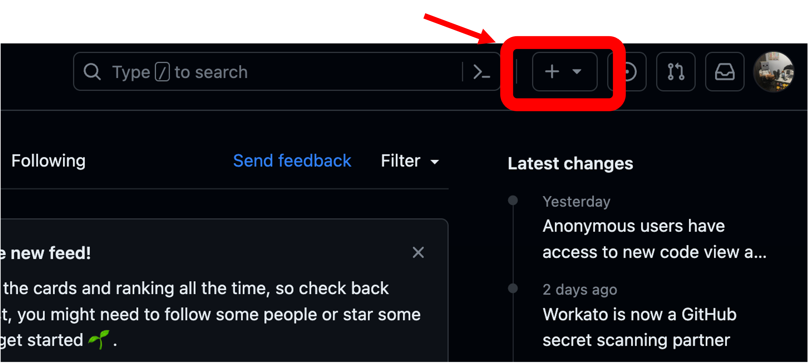
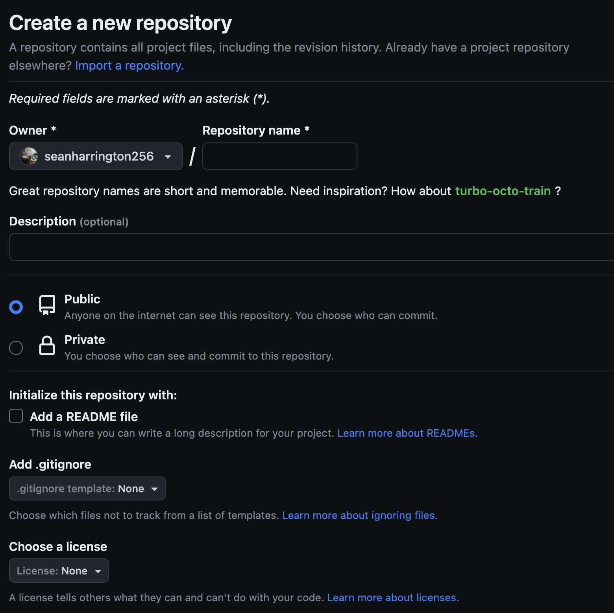
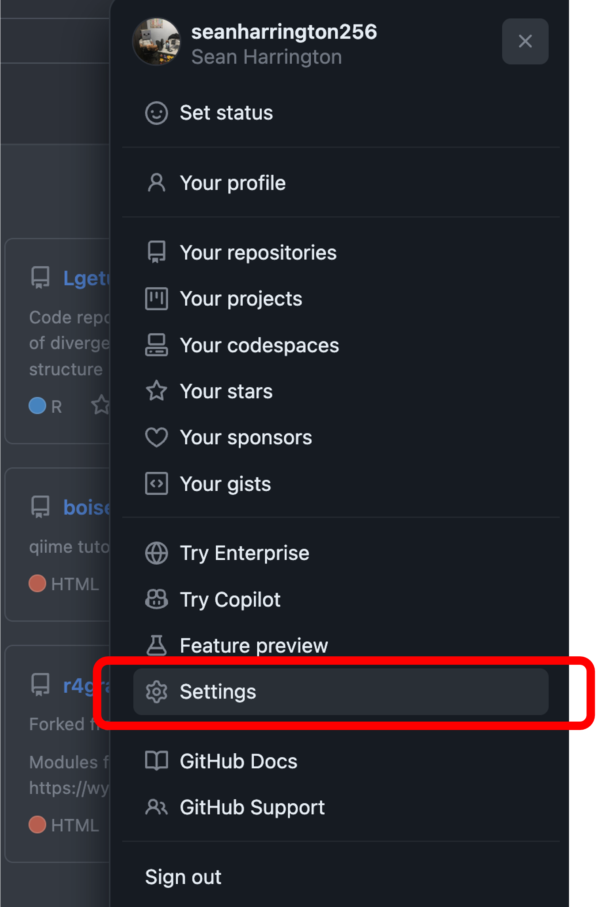
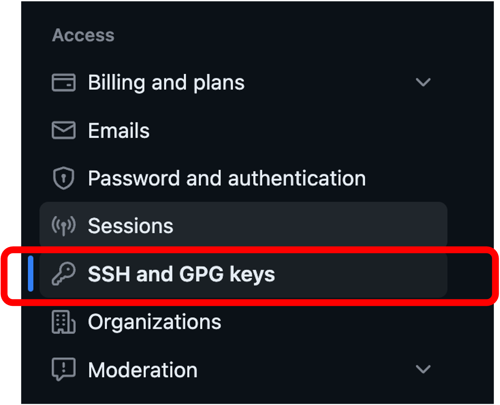
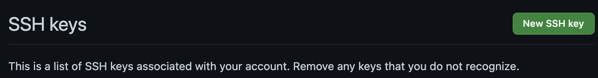
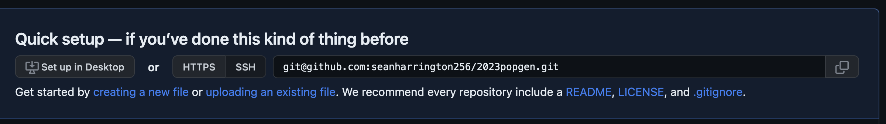

# Introduction to Git & Github


July 20, 2023

[Home](https://github.com/wyoibc/2023repres_popgen)

<br>


## Table of Contents

- [Overview](#Overview)
- [Create a Github account and repository](#Create-a-Github-account-and-repository)
- [Configuring Github on Beartooth](#Configuring-Github-on-Beartooth)
- [Git on Beartooth](#Git-on-Beartooth)
	- [Clone the Github repo](#Clone-the-Github-repo)
	- [New command line repo](#New-command-line-repo)
- [Tracking, pushing, pulling](#Tracking-pushing-pulling)
- [Reverting to a previous version](#Reverting-to-a-previous-version)
- [Collaborating on Github](#Collaborating-on-Github)


<br><br><br>
<br><br><br>


## Overview

[Git](https://git-scm.com/) is the most widely used version control system. Git tracks changes to files (including code scripts) and allows you to revert to older versions of files if necessary. This means that as you are working on code, you don't need to make and keep multiple versions of the same script in case any new changes break your pipeline. Having a single file with tracked changes is much easier than trying to keep track of multiple different versions of the same file or trying to remember which of `script_v8_FIXED.R` or `script_v8_FINAL.R` is the correct script with your most recent edits.

[Github](https://github.com/) is the most commonly used Git repository hosting service (you can see a comparison of some others [here](https://www.git-tower.com/blog/git-hosting-services-compared/)). Github allows Git users to easily access their code from anywhere, share and collaborate on projects, and host websites. The tutorials for this workshop are all hosted in a Github repository, as you've likely already noticed.

I use Git + Github for code for all of my research papers, both to keep the code tracked and to share the code when publishing manuscripts. E.g., a paper I published in early 2023 links to [this Github repo](https://github.com/seanharrington256/Lgetula_gbs) so that anyone can see my code and replicate my analyses.

While you can also use git & Github for manuscripts themselves, I prefer to use Google Docs for this purpose. Google Docs tracks changes in its own [version history](https://support.google.com/docs/answer/190843?hl=en&co=GENIE.Platform%3DDesktop), allowing you to revert if necessary.


* Git is completely free and open source, Github is a for-profit company, and some features of Github can require a paid account. Most academic users will be able to get by with a free Github account without any issues.

<br>
<br>

## Create a Github account and repository

We'll start by creating a repository on Github. If you don't already have a Github account, go to [Github](https://github.com/), click `Sign up` in the upper right, create an account. If you already have an account, sign in. Once signed in, click on the `+` button in the upper right:




and then `New repository`. This should open a page that looks like this:




In "Repository name" enter `2023popgen`. This will obviously be the name of the repository, but will also be part of the web address to the Github page for the repository as well as the name of the directory for the git repository when you clone it to your own computer, Beartooth, or another server.

In `Description`, you can enter something like "Repo for 2023 Popgen workshop". This should be relatively brief, more detail about the repository and files it contains will go into the Readme file.

Below Description, you can select whether to make the repository public or private. If the repository contains files and code that you want to be made available to anyone, you should keep it public (e.g., code that accompanies a paper you've published). Private repositories are used if you have code that is proprietary or if you don't want others to know what you are working on. You can switch repositories between private and public after creation, so you can keep a repository private while working on analyses and then make it public for review and publication if you like.


We can leave the rest of the options at defaults and click `Create repository`. You should now have an empty Github repository. We’ll use Git on Beartooth to add the contents of this repository.


<br>
<br>

## Configuring Github on Beartooth

We need to do some work to link Beartooth to your Github account.

To start, you will need to make sure that you own and can access your `~/.ssh` directory, if you do not, you will need to email ARCC ([arcc-help@uwyo.edu.](mailto:arcc-help@uwyo.edu.)) and have them transfer ownership of that directory to you. You can check the ownership by running `ls -ld ~/.ssh`. You should see a series of letters and a number followed by your username twice if you own the directory or followed by `root` twice if the directory is owned by root. If you own the directory, you’re good to continue on.

You need to start by generating an ssh key pair that will allow your computer (or Beartooth in this case) to securely interact with Github. You can read more about ssh keys [here](https://wiki.archlinux.org/title/SSH_keys), we won't get into any details about them. To create the ssh key pair, run the following:

```
ssh-keygen -t rsa
```

It will ask where you want to create the file, with a default of `.ssh/id_rsa` within your home directory. Just hit enter without entering any text and the key will be created there.

Then it will ask you for a passphrase, which you can leave empty by just hitting enter both times when prompted. I’m not using a passphrase here, but you can if you want; just make sure to remember it, as you’ll be asked for it any time you use the key.

Now we need to go copy the public key so that we can associate it with out Github account. I use `less ~/.ssh/id_rsa.pub` to look at the key and copy it (`q` quits less). Make sure you’re copying the **public key**, ending in .pub, not the private key.

On Github, in the top right click on the circle icon and go to `Settings`




then on the left side of the page that takes you to, select `SSH and GPG keys`



then click on `New SSH key`




Copy your public key into the `key` box and give it an informative title to differentiate it from other keys you may add from your own or other computers, then click `Add SSH key`. The key is now added to Github.


<br>
<br>


## Git on Beartooth


Now that Github is set up, we'll start using Git on Beartooth. Git is already installed on Beartooth and should also come installed on Mac and Linux operating systems, but will [need to be installed on Windows](https://gitforwindows.org/) (unless this has changed recently, which is possible).

We'll need to start by configuring Beartooth to use the ssh key that we linked to Github:

```
ssh-add ~/.ssh/id_rsa # add the key
ssh-add -l # make sure the key is being used
```

The key should be listed after running that second command.

If the former commands do not work and you get an error like could not open a connection to your authentication agent, it most likely means that the ssh-agent is not running. In that case, run:

```
eval `ssh-agent` # only necessary if the previous commands did not work
```


Now we can create a config file in our .ssh directory (or edit it, if it already exists) to complete the setup. Use you preferred editor to open and edit `~/.ssh/config` in your home directory. As stated in the [Intro to Beartooth](https://github.com/wyoibc/2023repres_popgen/blob/master/Intro_beartooth.md) tutorial, I like to use Cyberduck to interface with BBedit. If you haven't set this up, you can always use `nano` or `vim`.

* Note that if you are using Cyberduck to look for the `.ssh` directory within your home directory, you'll need to go to the `view` options (up by file, edit, etc) in the taskbar and check `Show Hidden Files`. The name will be gray, but this will cause it to be visible.

add the following to the file **(edited for your own username)**, then save and close it:

```
Host *
   AddKeysToAgent yes
   IgnoreUnknown AddKeysToAgent,UseKeychain
   UseKeychain yes

Host YOURGITHUBUSERNAME.github.com
        HostName github.com
        User git
        PreferredAuthentications publickey
        IdentityFile ~/.ssh/id_rsa
```

You may also need to change the permissions on this file to make sure that you can read and write it.

```
chmod 600 ~/.ssh/config
```

From here, there are two ways to create a local repository that is linked to Github:

<br>


### Clone the Github repo

Since we have already created the repo on Github, the easiest way to link up that repo to Beartooth is to simply clone the repository. Go to the Github page for your `2023popgen` repository, and you should see something that looks like this, but with your username instead of mine:



If you see `https` at the start of the web address there instead of `git@`, click the `ssh` button just to left of that.

You can then just copy that address and **on Beartooth** run:

```
git clone git@github.com:YOURUSERNAME/2023popgen.git
```

Replacing the address after `git clone` with what you copied from Github.

You should now see a new directory on Beartooth called `2023popgen` that is linked to Github.

<br>


### New command line repo

Alternately, instead of cloning, you can do all of this linking and setup from the command line on Beartooth. This follows the instructions that you'll see on Github just below the address we copied and pasted above.

I'm going to delete the current empty repo that we just cloned first:

```
rm -r 2023popgen
```

Then create a new directory with the same name, move into it, and initialize it as a git repo:

```
mkdir 2023popgen # create directory
cd 2023popgen # move into it
git init # this makes this a git repository
```

`git init` is required to turn this from a standard directory into a git repository that we can use to track changes and link to Github.

Let's add a readme file (all git repos should have one), add and commit that file (we'll talk about that more in ust a bit):

- Side note: Text in README.md will show up on the main page for your Github repo, and it should contain detailed descriptions of your code or instructions on where to find such descriptions.

```
echo "# 2023popgen" >> README.md # put text into new file "README.md"
git add README.md # add the readme file to the git staging area
git commit -m "first commit" # commit staged changes
```

Now we have created this as a local git repo and created a new file in it. Now we can now configure this to work with Github and push the changes to Github - **remember to edit your username in this code**:

```
git branch -M main
git remote add origin git@github.com:YOURUSERNAME/2023popgen.git
git push -u origin main
```

If you go look at your Github repo, you should see that the readme file has been added to it.


<br>
<br>


## Tracking, pushing, pulling

In that last section, we quickly did a couple things that are worth talking more about.

When you make changes to a file, you need to tell git to take a snapshot of these changes and add them to the staging area using `git add`.

E.g., after making changes to README.md, you can track a specific file as we did above:

```
git add README.md
```

or just add any changes to all contents of the current directory/repository:

```
git add .
```


Then you need to "commit" all of your staged changes to actually record these changes in git. You also need to include a message, which should be informative but not overly long:

```
git commit -m "add description"
```

These changes are now recorded in your local git repository, but still have not been synced with Github. To do this, you will need to run:

```
git push
```

This will push the changes to the remote repository, which we set up above.

In some cases, you will want to have a local copy of your repository on multiple computers. This lets you work on the same code on multiple machines, and you can use Github to sync up changes. For example, I have copies of this workshop repository on my office desktop computer and also on my laptop so that I can make changes when I'm not in my office.

To copy your repository to a new computer, all you need to do is follow the steps above that we used to link Beartooth to Github (ssh keys, config file) and then follow the same step to clone the repository.

If you have multiple repository copies, you will need to make sure that changes you made on another computer are synced to whatever repository you are currently working on. E.g., if you make some changes to your repository on Beartooth, push those changes to Github, and then want to make more changes in a local copy of the repo on your laptop, you'll want to first download the changes from Github onto your laptop.

Updating your local repository with the changes from the remote repository can be easily done by running the following from within the repository:

```
git pull
```

If you forget to pull changes before making edits and locally edit a file that has already been edited on Github, you will need to reconcile any changes that are in conflict. We'll talk about this briefly in the section on collaborating with Github.


Note that you can clone any public Github repository if you like, and if the Github owner makes changes, you can update your repository using `git pull`. You will not be able to push to any Github repos that you are not an owner or collaborator on.


<br>
<br>

## Reverting to a previous version

As was stated at the start, git is a "version control" program and one of the things it lets you do is go back to old versions of a file, e.g., a previous version before you accidentally broke some code.

Let's demonstrate this. Edit your `README.md` to include the line:

```
Functional code
```

Then add, commit, and push the change:

```
git add .
git commit -m "code that works"
git push
```

Then edit that line in the `README.md` to

```
BROKEN code
```

and add, commit, and push

```
git add .
git commit -m "code that FAILS"
git push
```

Obviously your git messages will not be as straightforward as these, but it is important to use informative commit messages so that you can track down the right versions if you need to revert.

At this point, we might test out our new code and find out after a little while that it is actually broken. In this case, we might want to revert to the previous version.


To view old commits, you can use `git log` (use `q` to exit) for the full info, or get just the ID of the commits and the messages using:

```
git log --oneline
```

You can view a commit using `git checkout` followed by the index of your commit (replace ###### with the correct ID of your commit containing the functional code)

```
git checkout ######
less README.md # this should show you the file with "Functional code"
q # quit less
```

This doesn't actually revert our current main working branch to that state, just lets us look at it. We can go back to the main branch using:

```
git checkout main
```

Then, if we want to fully reset the main branch to that previous commit, we can use the following, again replacing `######` with the proper index of the commit you want to revert to:

```
git reset --hard ###### 
```

Now, when you look at the log of commits, you should not see the commit for the code that failed. We have backtracked to the commit before it:

```
git log --oneline
```


Note that on a shared repository, we would probably want to create a new branch, rather than using this kind of hard reset. We'll talk about branching briefly soon.

There are a lot more options and details to reverting changes that I haven't covered, and you can see a good overview [here](https://www.atlassian.com/git/tutorials/undoing-changes).


<br>
<br>


## Collaborating on Github

The simplest way to collaborate on Github is to add the Github accounts of your collaborators as collaborators to a Github repo. If you go into the settings for a repository on Github, towards the top on the left, there is a button for `Collaborators`. If you click this, it will take you to a page that will let you add people. Collaborators on a repo can push changes.

If you and collaborators are working on the same repo, whenever one of you pushes changes, the others will need to pull these changes before they can push their own changes. If you have conflicting changes when you try to pull your collaborators' changes (e.g., when you have both edited the same line in a file), you will run into a merge conflict that you will need to resolve. You can find info on this [here](https://docs.github.com/en/pull-requests/collaborating-with-pull-requests/addressing-merge-conflicts/resolving-a-merge-conflict-using-the-command-line); it is beyond the scope of what we have time for today.

If you are working on a new feature for a collaborative repo, it can often be useful to create a new [branch](https://docs.github.com/en/pull-requests/collaborating-with-pull-requests/proposing-changes-to-your-work-with-pull-requests/about-branches). This lets you work in your own parallel version of the repo until you have finished whatever feature you are working on, at which time you can [merge the branch](https://git-scm.com/book/en/v2/Git-Branching-Basic-Branching-and-Merging). You may often want to submit a [pull request](https://docs.github.com/en/pull-requests/collaborating-with-pull-requests/proposing-changes-to-your-work-with-pull-requests/about-pull-requests) and suggest that your branch be merged rather than merging the branch directly. When merging branches, you may still run into conflicts which [have to be resolved](https://docs.github.com/en/pull-requests/collaborating-with-pull-requests/addressing-merge-conflicts/resolving-a-merge-conflict-using-the-command-line), similar to if you pull changes that conflict with your local repo.


Another method of collaboration is to use [forks](https://docs.github.com/en/pull-requests/collaborating-with-pull-requests/working-with-forks/about-forks). A fork is a copy of a repository, including ones that you are not an owner or collaborator on, that allows you to suggest that your edits be added to the original repo by [creating a pull request from the fork](https://docs.github.com/en/pull-requests/collaborating-with-pull-requests/proposing-changes-to-your-work-with-pull-requests/creating-a-pull-request-from-a-fork).


If you wish to create a copy of a repo without ever submitting a pull request, you can see documentation for how to do so [here](https://docs.github.com/en/repositories/creating-and-managing-repositories/duplicating-a-repository). Although you can also just create a fork and never submit a pull request.


<br>
<br>


<br><br><br>
<br><br><br>


[Home](https://github.com/wyoibc/2023repres_popgen)

<br><br><br>
<br><br><br>
<br><br><br>
<br><br><br>

