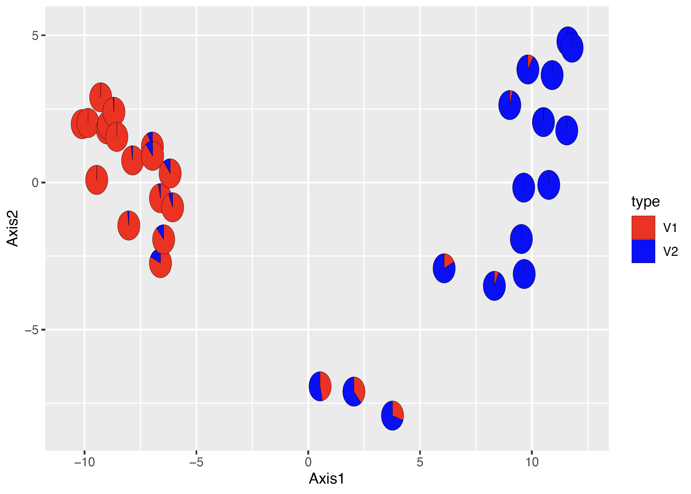

# Population structure & RStudio on Beartooth

July 27, 2023

[Home](https://github.com/wyoibc/2023repres_popgen)

<br>


## Table of Contents

- [Overview](#Overview)
- [RStudio on Beartooth](#RStudio-on-Beartooth)
- [File and path setup](#File-and-path-setup)
- [Basic stats](#Basic-stats)
- [Principal components analysis](#Principal-components-analysis)
- [Population structure using sNMF](#Population-structure-using-sNMF)
- [Plot population clusters to a map](#Plot-population-clusters-to-a-map)
- [Isolation by distance](#Isolation-by-distance)
- [Grouped PCA](#Grouped-PCA)


<br><br><br>
<center>


</center>
<br><br><br>


## Overview

[Last session](https://github.com/wyoibc/2023repres_popgen/blob/master/RADseq_processing.md), we processed RADseq data from the red diamond rattlesnake (*Crotalus ruber*)  to get it from the raw reads that we generally start with into aligned data. We now have files that are sequences of SNPs (single nucleotide polymorphisms) or loci that are on a common coordinate system for each individual sample. This allows us to now make inferences based on variation at sites in the alignment across samples. Today, we'll do some basic population genetic analyses to look at population structure. We will use the data we processed last time (or data that I've processed and you can copy if you are not caught up).


We'll do all of today's analyses in R. You could just download the necessary ipyrad output files to your local computer and R there, but we'll go over how to run R on Beartooth. Which of these options I choose depends largely on the size of input files and how computationally intensive the analyses are. I use my own computer for ease when files are small and analyses are short and Beartooth when they are not.

On Beartooth, there are multiple ways to run analyses in R: 

- Load up the R module, start R, and just run R interactively from the command line (I do not like to do this at all). 

- Write a script and then execute it non-interactively from the command line (e.g., `Rscript myscript.R`) -- I do this for scripts that I do not think have bugs or errors in them and that I do not need to interact with

- Use RStudio to interactively write and execute an R script


We don't have time to doa  full introduction to R for anyone who is new to it, but there are loads of good intro to R tutorials on the internet, or you can see my own intro tutorials [here](https://wyoibc.github.io/r4grads/).


<br>
<br>


## RStudio on Beartooth

We'll use the SouthPass interface available through ARCC to run RStudio. You can access SouthPass at **[https://southpass.arcc.uwyo.edu](https://southpass.arcc.uwyo.edu)**. This will take you to a Wyo Login page, use your regular UW username and password to log in.


<center>


</center>


These are various ways to interface with Beartooth. We won't get into what these all do, today we'll just use `Beartooth Xfce Desktop`. When you click on that icon, it will take you to a page that asks you to specify your project/account (this is the project that you put in when run an `salloc` session or in a slurm job script).


We'll select `3 hours` and `2 CPU, 8GB memory` for our Desktop Configuration.


* If you have computationally intensive analyses you need to run in R, the Beartooth Xfce Desktop may not have enough memory available. You can only select up to 16 Gb of memory as of the time of writing this tutorial

Then click `launch`. This should start quickly. This will go to a new page that will show the job as queued briefly, then you should see the option `Launch Teton Xfce Desktop` show up. Click that to start the session. 

This will start up an interactive desktop session. This will look like a standard desktop, but you are running on a Teton compute node. To start up RStudio, open up the terminal emulator (either in the bottom bar or Applications in the top left).


In the terminal emulator, load the RStudio module and then start up RStudio

```
module load gcc/12.2.0 r/4.2.2 rstudio/2022.12.0
rstudio &
```

The `&` will push the RStudio process to the background so that we can continue to type other commands into the terminal while RStudio is running. You should now have an open RStudio window. This will look just like RStudio would on your local computer. 


<br>
<br>


## File and path setup

We will start by making sure everyone has the necessary files and knows where they are. To make sure everyone is on the same page, you can copy my output files. Copy these to wherever you want (gscratch or your project directory) and keep track of the path to these files, we'll need this path inside of R.

In a Beartooth terminal, either the terminal inside your SouthPass session or a regular Beartooth session in a terminal, navigate to where you want to have the data and run:


```
cp -r /project/inbre-train/2023_popgen_wkshp/precooked_out/ipyrad_out/ruber_reduced_denovo_outfiles .
``` 

This directory also has the localities file that we will need.

From here on, we'll work in RStudio. Go back to your RStudio window and open up a new R script:


<center>

</center>


Use the same file menu to save the file as whatever you'd like, I'll save mine as `ruber_popstruct.R`. I recommend saving it in the `scripts` directory that we made last time. 

You should now have 4 panes in your RStudio session, a script, a terminal, and two other panes that include a file navigator, environment viewer, plot viewer, etc. We don't have time to get into all of the features of RStudio now, but it's a very useful tool.


We're now ready to start scripting in R. Enter all of your code into the script so that you can save everything. You can then run the code from the script by hitting `ctrl+enter` or `command+enter` on the line you want to run or on a whole block of code that you select. You can also use the `Run` button at the top of the script window instead of `ctrl+enter` or `command+enter`.


You will need to start by installing some packages (this only needs to be done once and should not be included in the script):


```r
install.packages(c("adegenet", "plotrix", "mapdata", "BiocManager", "vcfR", "fossil", "scatterpie", "mapproj", "MASS"))
BiocManager::install("LEA")
```

This may take several minutes. Once that's done, we can load up the packages (this *should* be included in the script, because it needs to be run every time you run the script):

```r
# Load up necessary packages
library(vcfR)
library(adegenet)
library(LEA)
library(mapdata)
library(ggplot2)
library(scatterpie)
library(mapproj)
library(fossil)
library(MASS)
```


Then we will specify a number of file paths and read in a few files so that we don’t have to repeatedly hardcode file paths farther down in the script. This makes it easier to reuse the script on different datasets or the same data with different filtering schemes without having to search through the script for every time an absolute file path is specified.

* ***These are my file paths, edit it them to your own**

```r
## Set up an object containing the path to the data
data_dir <- "~/inbreh/2023_popgen_wkshp/ipyrad_out/ruber_reduced_denovo_outfiles"

## make a directory to put the output plots into
##    this can be wherever you like, I'm putting it into the directory that contains
##    my scripts and ipyrad output directories
out_dir <- "~/inbreh/2023_popgen_wkshp/pop_struct_out"
if(!dir.exists(out_dir)){ # check if the directory  exists and return TRUE if it does not
  dir.create(out_dir)   # create the directory if it does not exist
}

# Set up an object that contains the base file name of files in the output directory. 
#    Data files are all this basename with varying extensions
#  we won't call this 'basename' because that is a function in R
#  setting up the files this way allows us to easily run this script on another assembly 
#    without needing to edit file names everywhere they occur
basefile <- "ruber_reduced_denovo"

# Read in the geographic coordinates for plotting later
coords <- read.csv(paste0(data_dir,"/Localities.csv"), header=TRUE, row.names=NULL)


####################################################################################
## Set up paths to input files using the base file name specified above
####################################################################################
path_ugeno <- paste0(data_dir,"/", basefile,".ugeno")
path_ustr <- paste0(data_dir,"/", basefile,".ustr")
path_vcf <- paste0(data_dir,"/", basefile,".vcf")

### Set up some colors for plotting farther down
colors_2 <- c("red", "blue") # colors for plotting 2 populations


# Set the working directory to the output directory
setwd(out_dir) # set directory as the output directory
```


With the file paths and ipyrad base names set up above, everything below here should require very little modification to run on different assemblies. Some exceptions include colors if you run a dataset with more populations and the geographic extent of the map to plot.


<br>
<br>

## Basic stats

Let's start by reading in the data and calculating some very basic population genetic summary statistics.

Read in the dat a from the vcf file:

```r
gendata_all <- read.vcfR(path_vcf) # read in all of the genetic data from the vcf file
gendata <- vcfR2genind(gendata_all) # convert to genind format
```


Calculate observed and expected heterozygosity:

```r
# Use adegenet's summary function on the genind object
genstats <- summary(gendata)

# and make overlapping histograms
hist(genstats$Hobs, breaks = 15)
hist(genstats$Hexp, add = TRUE, col = scales::alpha('blue',.25))
```


<center>

</center>

Looks like we might have lower observed than expected heterozygosity. Let's check the means across loci to confirm:

```r
# and look at the mean of each
mean(genstats$Hobs)
mean(genstats$Hexp)
```


Yep, we have low observed heterozygosity compared to expected. One likely reason for this is if there is population structure in the data. We'll test for this shortly.

<br>
<br>

## Principal components analysis


Principal coordinates analysis, or PCA, is a common dimensionality reduction method to see how data cluster without assigning groups or number of groups a priori. We can apply this method to genetic as well as other types of data. We'll follow [documentation from the adegenet package](https://adegenet.r-forge.r-project.org/files/PRstats/practical-MVAintro.1.0.pdf) to run PCA on our data:

```r
# calculate allele frequencies and replace NAs
genfreq <- tab(gendata, freq=TRUE, NA.method="mean")

# run the PCA
pca_res <- dudi.pca(genfreq, center=TRUE, scale=FALSE)
```

This will ask you how many principal components you want to retain. The eigenvalues (height of the bars) for each of these compnents roughly corresponds to the amount of genetic variation explained by each principal component. General advice is to retain all components before they drop off sharply. We need to retain at least 2 to make the plots we want, so let's keep 2.

After you enter `2`, the previous command will tell you that you can get the same result non-interactively by running:

```r
pca_res <- dudi.pca(df = genfreq, center = TRUE, scale = FALSE, scannf = FALSE, nf = 2)
```


Make a simple plot:

```r
plot(pca_res$li, pch = 19, cex = 2, col = "blue")
```


<center>

</center>

Looks like we probably have 2 distinct populations with some admixed individuals in between them. Next, we'll run a population clustering method to test this.


<br>
<br>


## Population structure using sNMF


Population assignment is a critical step in many population genetic and phylogeographic studies. Most downstream methods for estimating gene flow, divergence, population size, and other interesting population parameters require populations to be specified by you. If you have population structure in your data that you have not adequately accounted for, this can bias many types of analyses. E.g., if you try to estimate the history of population size changes in a group of samples that you assume are a single population when they actually come from multiple discrete populations, this will bias your results.

There are multiple ways to assign individuals to discrete populations. In some cases, you may have a priori ideas about population boundaries based on geographic discontinuities, differences in morphology across a species range, previous genetic data, or other sources of information. However, most of the time you will want to infer the number of populations and population membership of individuals directly from your data. This is essentially a classification problem: we are seeking to classify our whole set of genetic samples into a number of populations, often while also seeking to determine how many populations are present.

One of the most commonly used programs for the inference of population structure is the aptly named program [Structure](https://web.stanford.edu/group/pritchardlab/structure.html). Structure is a model-based clustering method that seeks to split individuals into clusters such that linkage disequilibrium is minimized and Hardy-Weinberg equilibrium is maximized within each cluster. Structure us a Bayesian method that relies on Markov chain Monte Carlo (MCMC) sampling, and can thus become somewhat unwieldy with large datasets. Many fast alternatives have been developed since the advent of Structure, including [Admixture](https://dalexander.github.io/admixture/) which utilizes the same model from Structure, but in a faster maximum likelihood implementation. Other alternative approaches do not explicitly model Hardy-Weinberg equilibrium or linkage disequilibrium, including the sNMF appraoch implemented in the [LEA R package](http://membres-timc.imag.fr/Olivier.Francois/LEA/files/LEA_github.pdf) and DAPC as implemented in the [Adegenet R package](https://github.com/thibautjombart/adegenet). All of these methods often produce comparable results, which are often visualized as barplots of the estimated membership of each sample in one or more population clusters or as pie charts of the same information plotted onto a map as show in the figures below.

<center>

</center>

<center>

</center>


If using DAPC to estimate population membership, it is important to note that in my experience, with large amounts of data, DAPC is very good at estimating which population a sample belongs to, but if a sample is admixed, it will be confidently placed into the population that it shares the most ancestry with. Barplots or pie charts of DAPC reflect the uncertainty in classification rather than amount of admixture, so care should be taken not to interpret DAPC plots the same way as plots from Strucure, Admixture, sNMF, etc.


I like to use sNMF rather than Structure because it's very fast and produces results highly similar to Structure. **sNMF can have trouble with samples that have high amounts of missing data, though**, with high missing data causing individuals to appear to be admixed. In such cases, the estimates of admixture that you get out of Structure or Admixture may be better than those from sNMF.


The snmf function requires a `geno` file as input, and requires that it has the extension `.geno`. We want to use only unlinked SNPs here (i.e., 1 SNP per RAD locus, assumed to be unlinked), and the geno file of unlinked snps from ipyrad has the extension `ugeno`, so we'll copy the file and give it a new extension:


```r
# Use a regular expression substitution to generate the new file name
path_geno<-gsub(".ugeno", ".u.geno", path_ugeno)

file.copy(path_ugeno, path_geno) # do the copying with the new name
```

Now we’re ready to run sNMF. We’ll run this using 1 to 10 possible ancestral populations and evaluate the fit of these different numbers of populations (referred to as k values) to the data using the cross entropy criterion:


```r
obj.at <- snmf(input.file = path_geno,  # input file is the .geno format file
               K = 1:10, # we will test for k=1 through 10
               ploidy = 2, 
               entropy = T, # use the cross entropy criterion for assessing the best k 
               repetitions = 10, # Run 10 independent replicate analyses
               CPU = 2, 
               project = "new", tolerance = 0.00001, iterations = 500)
```


Let’s make a pdf of the cross-entropy plot


```r
pdf("snmf_cross_ent.pdf", width = 8, height=5)
plot(obj.at, col = "lightblue", cex = 1.2, pch = 19)
dev.off()
```

Then go take a look at this file. You should see that the best fit model is one with 2 populations, as shown by the lowest cross-entropy score. We can also look at a numeric summary of this result:


```r
outstats <- summary(obj.at)
outstats
```

We can also confirm cross entropy values for K are consistent across runs and get the single best run for K=2.


```r
ce <- cross.entropy(obj.at, K = 2) 
ce # pretty similar
best.run <- which.min(ce) # find the run with the lowest cross validation error
```

Then we can get the snmf Q matrix from the best run at the best k, which is a matrix of the proportion of ancestry that each sample derives from each population.

```r
qmatrix <- Q(obj.at, K = 2, run = best.run)
admix<-as.data.frame(qmatrix)
```

This will let us plot out these proportions to a map, which we'll do next with a little additional setup.

<br>
<br>


## Plot population clusters to a map

Start by sorting out the coordinates of each individual into the same order as the individuals in the genetic data and make sure that there is gepgraphic data for each individual in the genetic data


```r
ind_names[which(!ind_names %in% coords[,"Field.No."])] # check if there are any individuals not in the coordinates
# match up the coordinates to the order of the individuals from snmf
match_coords<-match(ind_names, coords[,"Field.No."])
snmf_coords<-coords[match_coords,]

# get the coordinate and admix data into a single dataframe to plot out these proportions on a map
for_pies <- cbind(snmf_coords, admix)
```

Get out the mapping data for USA states and for Mexico and then combine them together

```r
states <- map_data("state") # US states data
mex <- map_data("worldHires", "Mexico") # Mexico data
mex$group <- mex$group + max(states$group) # have to do this to get rid of weird lines that show up otherwise because of groups in Mexico already being group numbers in states
to_map <- rbind(states, mex) # combine these together
```


Use ggplot to plot scatterpies on a map using the objects we just set up:

```r
snmf_plot <- ggplot(to_map, aes(long, lat, group = group)) + # map out the US & Mexico
  geom_polygon(data = to_map, fill = "grey90", color = "black", size = 0.2) + # make them polygons
  geom_scatterpie(data = for_pies, aes(x=Longitude, y=Latitude, group = Field.No., r = 0.2), cols = grep("^V", colnames(for_pies), value = TRUE), size = 0.1) + # plot the pies - use grep to get the column names that start with V, these are the admix proportions
  scale_fill_manual(values = colors_2) + # fill with the colors we defines above
  guides(fill="none") + # get rid of the legend for admixture
  theme_minimal() + # minimal theme
  labs(title=paste0(basefile,"_SNMF_K = 2"), x ="Longitude", y = "Latitude") + # plot title and x & y labs
  coord_map("moll", xlim=c(-118,-109), ylim=c(22,34)) # Mollweide projection and set bounds of plot

pdf(file=paste0(basefile,"_SNMF_plot.pdf"), width=10, height=10)
print(snmf_plot)
dev.off()
```

You should get something that looks like this:


<center>

</center>

We can see a genetic break in southern Baja California with admixture where the populations contact and extending into the northern population. 


<br>
<br>

## Isolation by distance

An additional critical consideration is that  continuous spatial genetic structure across the range of a population can be highly problematic for population structure methods. One of the most common types of continuous spatial structure is isolation by distance (IBD), which occurs when dispersal is limited and individuals that are geographically closer are more related than individuals that are geographically distant. If IBD is strong enough, population structure methods can incorrectly infer the presence of multiple discrete populations with a gradient of admixture between the farthest individuals. This problem is reviewed well in [Bradburd et al. 2018](https://academic.oup.com/genetics/article-abstract/210/1/33/6088031) and they developed the method conStruct to simultaneously continuous and discrete spatial structure. I have had trouble getting it to work on my own data, so we won't use it in the workshop. In any case, testing to isolation by distance and being aware of its potentially misleading effects can help to prevent incorrect inferences of population structure.


Here, we’ll do a quick test and visualization of isolation by distance to try to determine if IBD is misleading our population structure analyses.

We’ll start off by running a Mantel test, which correlates two different distance matrices. We’ll need to convert our DNA and geographic data into pairwise distances for this test:


```r
Dgen <- dist(gendata) # get the genetic distances
Dgeo <- earth.dist(snmf_coords[,c("Longitude", "Latitude")]) # get the geographic distances
```

then run the test:

```r
ibd <- mantel.randtest(Dgen,Dgeo) # run the mantel test
```

We can then visualize the result of our empirical estimate of isolation by distance compared to a permuted null distribution to see how significant our result is. We’ll also plot out a kernel density plot of genetic vs. geographic distances to visualize how these distances are associated.

```r
## PDF of mantel output and a kernel density plot of genetic vs. geographic distance
pdf(file="Mantel_KD.pdf", width=8, height=8)
plot(ibd, main=paste0("mantel p = ", ibd$pvalue)) # plot out the IBD significance

## make kernel density plot of genetic and geographic distances
dens <- kde2d(as.numeric(Dgeo),as.numeric(Dgen), n=300)
myPal <- colorRampPalette(c("white","blue","gold", "orange", "red"))
plot(Dgeo, Dgen, pch=20,cex=.5)
image(dens, col=transp(myPal(300),.7), add=TRUE)
abline(lm(as.numeric(Dgen)~as.numeric(Dgeo)))
title("IBD plot")
dev.off()
```

This will make a 2-page pdf of these plots. Looking at the first page, we can see that we have highly significant isolation by distance, with the lowest possible significance value given our number of permutations in the Mantel test (999 by default). The diamond-shaped point with the line indicates our empirical estimate, with the permutations shown as the gray histogram.


<center>

</center>


If we look at the second page, we can see how the geographic and genetic distances are correlated. What we see is a positive relationship, but with a major disjunction. This type of disjunction indicates the presence of some level of not fully continuous spatial genetic structure.

<center>

</center>


If we had only pure IBD, we would expect a single, roughly linear cloud of points. We won't reproduce this here, but when looking at only the northern population, we find a pattern that looks much more like pure IBD.

<center>


</center>


These plots can help reassure us that there is IBD in the data, but some kind of discrete structure across the whole species, which is what we are detecting with sNMF, etc., but no further discrete structure within the northern population. 


<br>
<br>


## Grouped PCA

If there is time, we can explore how to color the points of the PCA we ran earlier by the populations clusters identified by sNMF.


We'll use the `qmatrix` that we extracted from the sNMF output (contains the proportions of ancestry from each cluster). We can iterate over the rows of this to find out which cluster each sample has the maximum membership in:

```r
cluster <- apply(qmatrix, 1, which.max)
```

Then we can use this to create a vector of colors for each point when we plot the PCA:

```r
PCA_cols <- cluster
PCA_cols[PCA_cols == 1] <- "red"
PCA_cols[PCA_cols == 2] <- "yellow"
```

Plot it out, setting these as the background (`bg`) colors for outlined circle points:

```r
plot(pca_res$li, pch = 21, cex = 2, bg = PCA_cols)
```

<center>

</center>

Cool, looks like this corresponds to our two populations.


What if we want to check if three in the middle are the ones identified as highly admixed by sNMF? We can use an `apply` statement with a simple anonymous function to find the rows of the Q matrix for individuals that do not have more than 0.7 of their ancestry from any single cluster:

```r
high_admix <- apply(qmatrix, 1, function(x) max(x) < 0.7)
```

and then use this to index the `PCA_cols` object and swap out the colors of these individuals for `orange`, then re-plot:


```r
PCA_cols[high_admix] <- "orange"
plot(pca_res$li, pch = 21, cex = 2, bg = PCA_cols)
```

<center>

</center>


Looks like the admixed individuals are the intermediate ones, that's cool.


Since we only have two population clusters, we could also use ggplot and color points along a gradient depending on the value of ancestry in cluster 1. To do this, we'll make a single dataframe that has the PCA coordinates and the qmatrix values in it:

```r
pca_q <- cbind(pca_res$li, qmatrix)
```

Then use ggplot to make a scatterplot colored along a gradient:

```r
ggplot(pca_q, aes(x = Axis1, y = Axis2)) +
  geom_point(aes(fill = V1), size = 6, shape = 21, color = "black") +
  scale_fill_gradient(low = "yellow", high = "red")
```


<center>

</center>

This gives us a better idea of how much admixture there is in each sample. We could do more tweaking to make this look better, but we'll stop here.


If we had more than just two populations, we wouldn't have a single gradient to color samples by. In that, maybe you'd want to plot pies of admixture proportions on the PCA. Here is how you could do that, using similar code to when plotting pies on a map:

```r
pdf(file="PCA_pies.pdf", width = 7, height = 5)
ggplot() +
  geom_scatterpie(data = pca_q, aes(x = Axis1, y = Axis2, r = 0.35), cols = grep("^V", colnames(pca_q), value = TRUE), size = 0.1) +
  scale_fill_manual(values = colors_2) # fill with the colors we defines above
dev.off()  

```


<center>

</center>


Again, we could alter the theme, legend, etc. to make this nicer.


<br><br><br>
<br><br><br>


[Home](https://github.com/wyoibc/2023repres_popgen)

<br><br><br>
<br><br><br>
<br><br><br>
<br><br><br>


