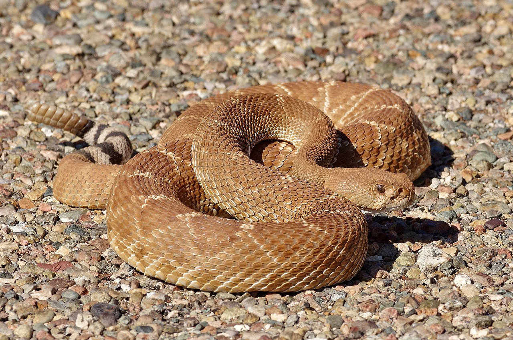

# RADseq data processing & assembly

July 25, 2023

[Home](https://github.com/wyoibc/2023repres_popgen)

<br>


## Table of Contents

- [Overview](#Overview)
- [Files and basic setup](#Files-and-basic-setup)
- [Fastq format](#Fastq-format)
- [Installing ipyrad](#Installing-ipyrad)
- [Branching an assembly](#Branching-an-assembly)
- [Examining the output](#Examining-the-output)
- [Branch to remove low data samples](#Branch-to-remove-low-data-samples)


<br><br><br>
<center>



</center>
<br><br><br>

## Overview

This week, we’ll be working with empirical double digest RADseq data ([Peterson et al. 2012](https://journals.plos.org/plosone/article?id=10.1371/journal.pone.0037135)) that I (Sean Harrington) generated as part of my PhD research at San Diego State University. The data are for a species of rattlesnake, the red diamond rattlesnake (Crotalus ruber), that is distributed across the Baja California peninsula and into southern California. I was interested in identifying if there is any population structure in C ruber and inferring what population genetic and environmental forces have resulted in any existing structure. The data are single-end reads generated on an Illumina hiSeq. My analyses of these data are published in [Harrington et al. 2018](https://onlinelibrary.wiley.com/doi/full/10.1111/jbi.13114).

The dataset is reasonably small and we should be able to quickly process and analyze it.

We will use [ipyrad](https://ipyrad.readthedocs.io/en/master/) to process and assemble the raw data into alignments. ipyrad is a flexible python-based pipeline for taking various types of restriction-site associated data, processing them, and generated aligned datasets.

iPyRad is capable of generating datasets either by mapping your raw reads to a reference genome or using a de novo assembly method that does not require a reference. We will use the de novo method today.

If you need help with ipyrad outside of this workshop for specific issues, you can always post [here](https://app.gitter.im/#/room/#dereneaton_ipyrad:gitter.im). Isaac is very responsive to queries.

* ipyrad is what I have always used to assemble my RADseq data, but it is certainly not the only option. [Stacks](https://catchenlab.life.illinois.edu/stacks/) is another popular option, or there are various ways to manually assemble or map RADseq data.


<br>
<br>


## Files and basic setup


Before we get started, everyone will need the following files:

- all_ruber.fastq
- barcodes_samples.txt
- names_ruber_all.txt

These are all contained on Beartooth at `/project/inbre-train/2021_popgen_wkshp/data`

You'll need to copy these data over to your own directory:

```
cp -r /project/inbre-train/2023_popgen_wkshp/data <where_you_want_these_files>
```

* I recommend putting these data and the other files we will create into a new directory in your project directory or in your gscratch directory

This will copy over a directory called `data`. I always recommend keeping raw data, scripts, and output all in separate places. Let's set up a directory for scripts and one for ipyrad output:


```
mkdir ipyrad_out
mkdir scripts
```


<br>
<br>


## Fastq format

Before we start doing anything with the data, it's worth seeing what the raw data look like. The standard format for all raw data for genomic sequences is fastq.

Navigate to where your all_ruber.fastq.gz file is located, and we’ll look at the first 8 lines of the file:

```
cd <path_to_your/all_ruber.fastq.gz>
zcat all_ruber.fastq.gz | head -n 8
```

* note that these reads are gzipped (end in .gz) you cannot directly look at them with `head` but instead need to use `zcat`, which reads gzipped files, and pipe the output to `head`. Fastqs are typically gzipped to save disk space and most genomics programs can read gzipped fastqs


That should return:

```
@SRR6143937.sra.1 1 length=96
TGATCGCTAANAGCAAATTGAGTCCCCTGCCCATCAGTTGATGATGTCATTGGTACTTTCTATTGTGTCAGGTCTTAACTTGCCATGTTTTTTTACTTTTATTA
+SRR6143937.sra.1 1 length=96
IIIIIIIIFD#24AFHJJJJJJIIJJJJJJJJJJJJJIJJJJJJJJJJJJJJJGHIJJJJJJJJJHIJJJJJ@FHIHIDHIHHHFHFFFFFFDDDDDCEDDDDA
@SRR6143937.sra.2 2 length=96
TGATCGCTTGNAGGGGGCGCATGAAGAGCGCAGGCACAGAGCAAGGCCCCGCCCTCCCCAGGGACTCATTGTGCAGTAACCGGATTGACTTCTCATGCACGCAG
+SRR6143937.sra.2 2 length=96
IIIIIIIIFF#22<DHIHJJJJJIJIJJJIJJJJHHHHFFFFFEECDDDDDDDDDDDDDDDDB<@BDDDEDEDDEDDD>CCDDBDDDDDDDDCDEEDDDDDDDB
```

Each read from the sequencer is represented by 4 lines: the first 4 lines are the first read, the second set of 4 lines are the second read, etc. For each read, the first line is the header, and always starts with @. This contains a sequence identifier and various information about the read, often including information about the sequencing run. The second line, after the header, is the actual DNA sequence of the read. The next line always starts with `+` and may contain either no additional text, or the sequence identifier and extra information, as in the header. Line 4 for each read, following the `+` line, indicates the quality score for each DNA base in the read. This line will be exactly the same length as the DNA sequence in the second line, with e.g., the 4th character in this line corresponding to the quality of the 4th base in the sequence, etc. You can find the meaning of each of these symbols in Illumina sequences [here](https://support.illumina.com/help/BaseSpace_OLH_009008/Content/Source/Informatics/BS/QualityScoreEncoding_swBS.htm).


<br>
<br>


## Installing ipyrad

We will use conda to install iPyRad and all of its dependencies. We went over [conda in the Intro to Beartooth session](https://github.com/wyoibc/2023repres_popgen/blob/master/Intro_beartooth.md#Conda) last week.
The first step is to load up the Beartooth modules necessary for miniconda:

```
module load miniconda3/23.1.0
```

Create a new conda environment called ipyrad, activate the environment, and install ipyrad:

```
conda create -n ipyrad  # create the environment: we only need to do this once
conda activate ipyrad  ### You will need to run this command every time you want to use ipyrad
conda install ipyrad -c conda-forge -c bioconda  ## You only need to run this once
```

<br>
<br>


## Running iPyRad

First, we need to generate a params file that contains the parameters we need to specify for ipyrad. In your `scripts` directory, run:

```
ipyrad -n ruber_denovo
```

This will create a params file with the defaults that ipyrad uses, we can modify these as we need . Whatever comes after the -n is what the assembly will be named

Let’s go look at and edit that. As I stated in the [Intro to Beartooth](https://github.com/wyoibc/2023repres_popgen/blob/master/Intro_beartooth.md#transferring-files-to-and-from-beartooth), I like to use Cyberduck coupled with BBedit to edit files. If you do not have that set up, you can use `nano` or `vim` to edit the file on the command line.

We’ll change a few of these parameters:

- `[1]`: This is where output will do, edit this to your `ipyrad_out` directory

- `[2]`: this needs to reflect the path to the `all_ruber.fastq.gz` file wherever it lives for you

- `[3]`: this needs to be the path to `barcodes_samples.txt`

- `[7]`: dataype should be `ddrad`

- `[8]`: restriction overhang is: `TGCAGG, GATC` these are the overhangs created by the restriction enzymes for ddRAD that was used for these data. I find these to be a pain to figure out, this is documented in the [ipyrad params documentation](https://ipyrad.readthedocs.io/en/master/6-params.html)

- `[27]`: change to `*`, this will generate all output formats that ipyrad is currently capable of

The rest of these are at generally reasonable values, although depending on your data, you may want to modify some of these. The parameters are all [well documented here](https://ipyrad.readthedocs.io/en/master/6-params.html).

- For our final dataset, we'll want to set parameter `[21]` "min_sample per locus" to something higher to end up with a reasonable amount of missing data, but we'll deal with his below


We'll start by running steps 1-5 as an `sbatch` job. To do this, create and open a new file called `ruber_denovo_1_5_.slurm` and populate it with the following, putting your account (project) and email where appropriate:

```
#!/bin/bash

#SBATCH --job-name ruber_denovo
#SBATCH -A *****YOUR_ACCOUNT*******
#SBATCH -t 2-00:00
#SBATCH --nodes=1
#SBATCH --cpus-per-task=8
#SBATCH --mem=16G
#SBATCH --mail-type=ALL
#SBATCH --mail-user=*****YOUR_EMAIL*********
#SBATCH -e ruber_%A_%a.err
#SBATCH -o ruber_%A_%a.out

module load miniconda3/23.1.0

## run ipyrad
conda activate ipyrad
ipyrad -p params-ruber_denovo.txt -s 12345 -c 8
```

Submit the job and then check that it's running:

```
sbatch ruber_denovo_1_5_.slurm
squeue --me
```


This should take around 20 minutes. While that's running, we can take a look at the steps, which are thoroughly [documented here](https://ipyrad.readthedocs.io/en/master/7-outline.html).


<br>
<br>


## Branching an assembly

We only ran steps 1-5 above because the Fastq file that we started with includes mostly individuals of the red diamond rattlesnake, *Crotalus ruber*, but also a few outgroup taxa. Right now, we want to make a dataset that includes only *C. ruber* individuals that we can run some popgen analyses on in the next session.

iPyRad includes functionality to make new “branches” of the assembly using different parameters and/or including/excluding different individuals, and we’ll take advantage of that functionality here.

- If we wanted to include all samples in the same dataset, we could've just run all 7 steps at once.

To create a new branch with only the desired individuals (edit the two `YOUR_PATH_TO` occurrences to your own paths):

```
# if your ipyrad conda environment is not already active, load conda and activate it
module load miniconda3/23.1.0
conda activate ipyrad

# if you are not already in your "scripts" directory, go there
cd YOUR_PATH_TO/scripts

# branch the assembly
ipyrad -p params-ruber_denovo.txt -b ruber_only_denovo ../data/names_ruber_all.txt
```

- note that `../data/names_ruber_all.txt` will work if you have set up yoru directories as I have, with `scripts` and `data` directories both in the same parent directory. If not, you will need to specify the path to `names_ruber_all.txt`

This will use our old assembly and params file to generate a new branch, with params file `params-ruber_only_denovo.txt` that includes only samples in the `names_ruber_all.txt` file.


We need to further edit this file to change parameter `[21]` “min_sample per locus”. The parameter defines how many how many individual samples a locus must have data for to include that locus in the final dataset. It controls the amount of missing data in the final dataset. Here, let's set this to `26` - this is about 75% of individuals and should result in a matrix that is ~75% or greater complete.

Use your favorite text editor and make this change in the file `params-ruber_only_denovo.txt`:

```
26               ## [21] [min_samples_locus]: Min # samples per locus for output
```


Once that change has been made, run the final 2 steps in ipyrad. This is fast on this dataset, but we'll submit it as a job, both for practice running sbatch jobs and because it's good practice to keep a record of your code, which you always have if you run code via scripts that you save.

Using your favorite text editor, create a file called `ruber_denovo67.slurm` with the following in your scripts directory (editing account and email):


```
#!/bin/bash

#SBATCH --job-name ruber_denovo67
#SBATCH -A *****YOUR_ACCOUNT*******
#SBATCH -t 0-30:00
#SBATCH --nodes=1
#SBATCH --cpus-per-task=8
#SBATCH --mem=16G
#SBATCH --mail-type=ALL
#SBATCH --mail-user=*****YOUR_EMAIL*********
#SBATCH -e ruber67_%A_%a.err
#SBATCH -o ruber67_%A_%a.out

module load miniconda3/23.1.0

## run ipyrad
conda activate ipyrad
ipyrad -p params-ruber_only_denovo.txt -s 67 -c 8
```

Submit the job and then check that it's running:

```
sbatch ruber_denovo67.slurm
squeue --me
```

<br>
<br>

## Examining the output

Before you start analyzing your data, you should always take a look at the output stats.

```
cd YOUR_PATH_TO/ipyrad_out/ # EDIT TO YOUR PATH (or ../ipyrad_out if organized as I have)
cd ruber_only_denovo_outfiles
less -S ruber_only_denovo_stats.txt
```

- remember `q` quits `less`

There should be about 2260 loci recovered in the assembly (last column of row `total_filtered_loci`). If we scroll down a bit in the table `The number of loci recovered for each Sample.`, we can see that SD_Field_0506 has almost no loci shared with other samples, and SD_Field_1453 has only about half as many loci as most samples. We’ll want to remove these samples before moving on. Note that SD_Field_0506 is an obviously failed sample, but for SD_Field_1453, you would likely want to try out some preliminary downstream analyses with and without this sample – I’ve already played with these data and decided it’s best to remove it.

<br>
<br>

## Branch to remove low data samples

Start by making a new names file to exclude SD_Field_0506 and SD_Field_1453


```
# Navigate to your data directory (the following works if you used my setup)
cd ../../data/
# copy the names file to edit
cp names_ruber_all.txt names_ruber_reduced.txt
```

Then use your favorite text editor to delete the lines containing `SD_Field_0506` and `SD_Field_1453`.

Do the branching (editing paths if you've set yours up differently than mine):

```
cd ../scripts
ipyrad -p params-ruber_only_denovo.txt -b ruber_reduced_denovo ../data/names_ruber_reduced.txt
```

Make another slurm script to run just step 7 as a job using your favorite text editor called `ruber_denovo_reduced7.slurm`:


```
#!/bin/bash

#SBATCH --job-name ruber_reduced7
#SBATCH -A *****YOUR_ACCOUNT*******
#SBATCH -t 0-10:00
#SBATCH --nodes=1
#SBATCH --cpus-per-task=8
#SBATCH --mem=16G
#SBATCH --mail-type=ALL
#SBATCH --mail-user=*****YOUR_EMAIL*********
#SBATCH -e ruber_red7_%A_%a.err
#SBATCH -o ruber_red7_%A_%a.out

module load miniconda3/23.1.0

## run ipyrad
conda activate ipyrad
ipyrad -p params-ruber_reduced_denovo.txt -s 7 -c 8
```

Submit and check on the job:

```
sbatch ruber_denovo_reduced7.slurm
squeue --me
```

Go look at the stats file for the new assembly:

```
cd ../ipyrad_out/ruber_reduced_denovo_outfiles/
less -S ruber_reduced_denovo_stats.txt
```

You should now see a slight decrease in the number of loci (I see 2212), but pretty good coverage across individuals, with no single sample having maassive amounts of missing data. This looks like a good dataset to move forward with.

We have all sorts of variously formatted data files in the output directory.


<br><br><br>
<br><br><br>


[Home](https://github.com/wyoibc/2023repres_popgen)

<br><br><br>
<br><br><br>
<br><br><br>
<br><br><br>